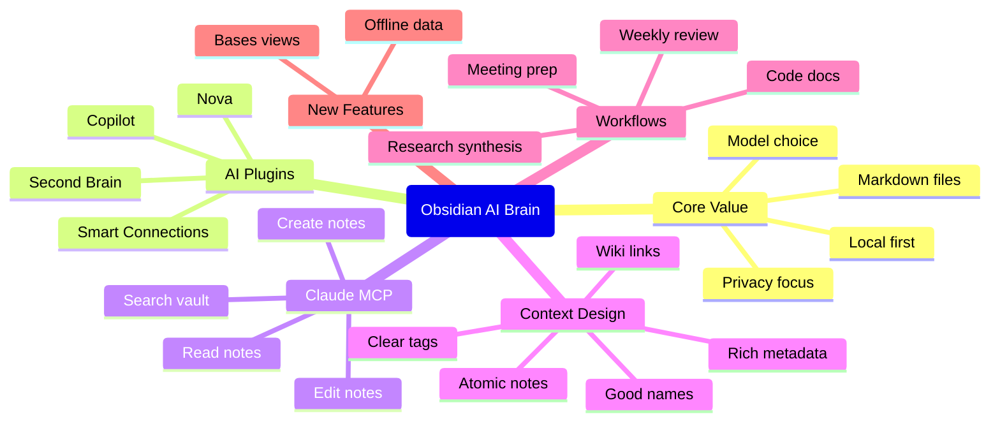

[https://www.nxcode.io/zh/resources/news/obsidian-ai-second-brain-complete-guide-2026](https://www.nxcode.io/zh/resources/news/obsidian-ai-second-brain-complete-guide-2026 "Obsidian AI 第二大脑：构建 AI 驱动知识系统的完整指南 (2026)")

## Summary

这篇文章围绕“Obsidian 作为 AI 第二大脑”展开，强调其本地优先、Markdown 文件、模型可替换和隐私友好的特性，使其在 2026 年成为构建个人知识系统的理想基础。相比 Notion 等云端工具，Obsidian 的优势在于数据归属清晰、可接入本地模型、支持 MCP 协议，并且能够让 AI 直接读取、搜索和组织整个知识库。

文章还详细介绍了 Smart Connections、Copilot、Nova 和 Smart Second Brain 等主流 AI 插件，并说明了 Claude Code 通过 MCP 与 Obsidian 联动后的能力升级。作者进一步提出“上下文工程”这一核心理念，强调命名规范、元数据、原子化笔记、显式链接和标签体系的重要性，最后给出了适合开发者、研究者、创作者等不同群体的实用工作流与快速入门配置步骤。

## Key Takeaways

- Obsidian 的本地优先架构让 AI 可以直接利用你的 Markdown 知识库，而不被单一平台锁定。
- 用户可以自由选择 Claude、GPT、Gemini、Ollama 或 LM Studio 等不同模型来构建自己的 AI 工作流。
- Smart Connections 和 Copilot 更偏向 RAG 问答，Nova 更适合行内写作编辑，Smart Second Brain 则强调完全本地化与隐私。
- Claude Code 通过 MCP 接入 Obsidian 后，可以跨库搜索、创建笔记、修改笔记并复用已有结构。
- 真正提升 AI 效果的关键不只是接入模型，而是做好上下文工程，让知识库更易被检索和理解。
- 一致命名、YAML 元数据、原子化笔记、双链和标签体系，都是提升 AI 检索质量的重要基础设施。
- Obsidian Bases 提供了更接近数据库的表格、画廊和地图视图，增强了结构化管理能力。
- 对个人知识工作者尤其是开发者、研究者和内容创作者而言，Obsidian 在灵活性和长期可控性上具有明显优势。

## Mindmap

## Notable Quotes

- “你的笔记变成了一个 AI 可以阅读、搜索和推理的知识库。”
- “这就像拥有一个以你的整个大脑为上下文的 AI 助手。”
- “拥有一个能读你笔记的 AI 很强大。拥有一个能有效利用你笔记的 AI 则是颠覆性的。”
- “这就是实践中的上下文工程 —— 结构化你的知识，以便 AI 能够有效利用它。”
- “你的笔记价值取决于你检索和应用它们的能力。”
[Timestamp: 2026/05/14 00:14:58]